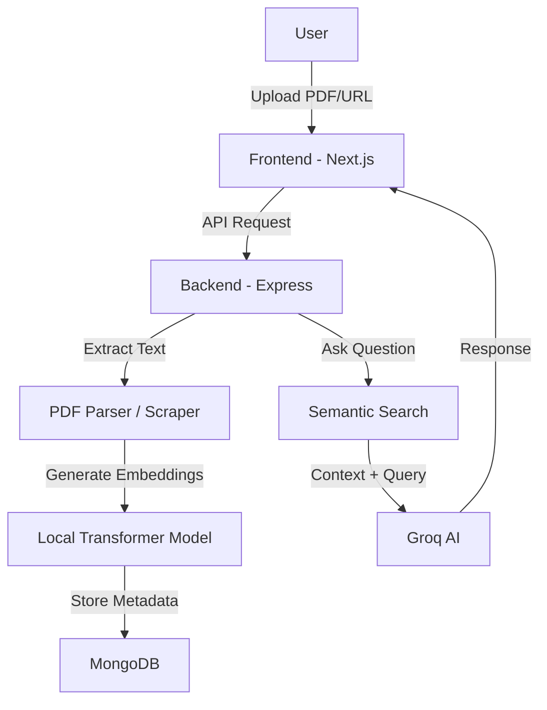

# Ask Docks AI 🚀

Ask Docks AI is a professional Retrieval-Augmented Generation (RAG) application that allows you to chat with your documents and web content. Upload PDFs or provide URLs to gain instant insights using state-of-the-art AI.


## ✨ Features

- 📄 **PDF Analysis**: Seamlessly upload and extract text from PDFs.
- 🌐 **URL Ingestion**: Scrape and index website content for interactive Q&A.
- 🧠 **Semantic Search**: Uses local embeddings (**all-MiniLM-L6-v2**) to retrieve the most relevant context.
- 💬 **AI Assistant**: Powered by **Groq** for high-speed, accurate responses.
- 📂 **Persistence**: MongoDB integration for storing document metadata and chat history.
- 🎨 **Modern Dashboard**: A sleek, responsive UI built with Next.js and Tailwind CSS.
- 🛡️ **CI/CD**: Automated testing and build validation via GitHub Actions.

## 🏗️ Architecture



## 🛠️ Tech Stack

### Frontend
- **Framework**: [Next.js](https://nextjs.org/) (App Router)
- **Styling**: [Tailwind CSS](https://tailwindcss.com/)
- **Icons**: [Lucide React](https://lucide.dev/)
- **State Management**: React Hooks

### Backend
- **Runtime**: [Node.js](https://nodejs.org/)
- **Framework**: [Express.js](https://expressjs.com/)
- **AI/ML**: 
  - [Groq Cloud](https://groq.com/) (Inference)
  - [Transformers.js](https://huggingface.co/docs/transformers.js/) (Local Embeddings)
- **Database**: [MongoDB](https://www.mongodb.com/) (Mongoose)

## 🚀 Getting Started

### Prerequisites
- Node.js 18+ 
- MongoDB (Local or Atlas)
- Groq API Key

### Installation

1. **Clone the repo:**
   ```bash
   git clone https://github.com/bhavish-codes/Ask-Dock-AI.git
   cd Ask-Dock-AI
   ```

2. **Backend Setup:**
   ```bash
   cd backend
   npm install
   # Create .env with MONGODB_URI and GROQ_API_KEY
   npm run dev
   ```

3. **Frontend Setup:**
   ```bash
   cd ../frontend
   npm install
   npm run dev
   ```

## 🧪 Testing
We use GitHub Actions to ensure code quality. You can run linting and builds locally:
```bash
# Frontend
cd frontend && npm run lint && npm run build

# Backend
cd backend && node --check src/index.js
```

## 🚢 Deployment
- **Frontend**: Deploy to Vercel (automatic via GitHub integration).
- **Backend**: Deploy to Vercel/Render. The project includes a `vercel.json` for seamless serverless deployment.

## 📄 License
MIT License. Created by [Bhavish Dhar](https://github.com/bhavish-codes).
