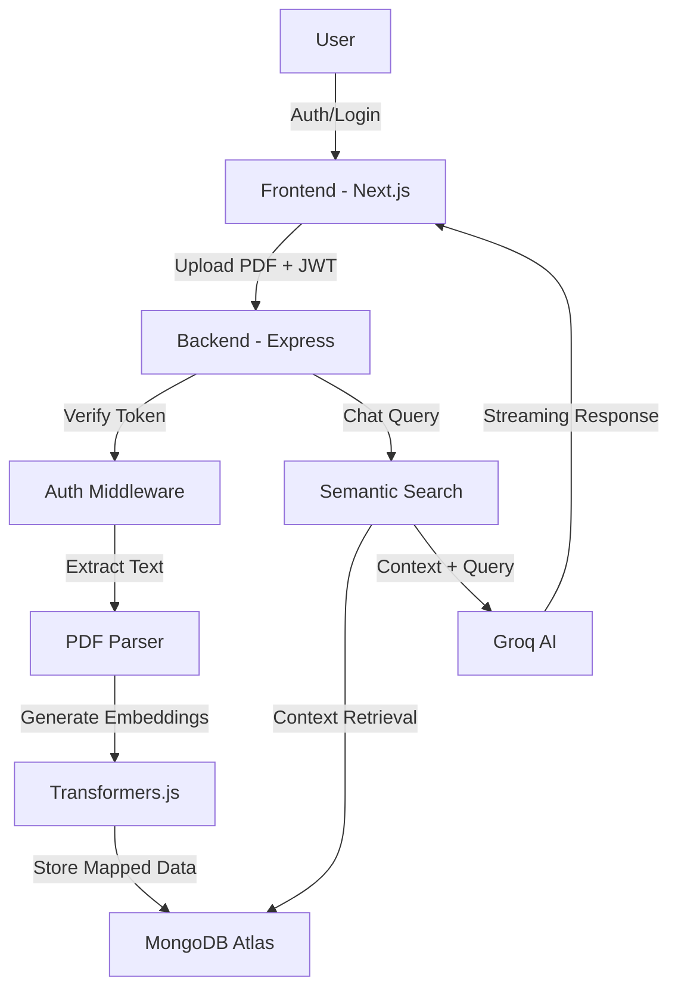

# Ask Docks AI 🚀

Ask Docks AI is a professional-grade Retrieval-Augmented Generation (RAG) platform designed for secure, private interactions with your documents. Built with a focus on data isolation and high-performance AI, it enables users to upload PDFs and engage in context-aware conversations using state-of-the-art Large Language Models.


## ✨ Key Features

- 🔐 **Multi-Tenant Security**: Full user authentication system with JWT-based sessions and encrypted password storage.
- 🛡️ **Strict Data Isolation**: Advanced access control ensures that every document and chat history is privately mapped to a specific user.
- 📄 **Smart PDF Processing**: Automated text extraction and semantic chunking for large document analysis.
- 🧠 **Vector-Based Retrieval**: Localized embeddings generation using the **all-MiniLM-L6-v2** transformer for high-precision semantic search.
- 💬 **High-Speed AI Chat**: Real-time interactive assistant powered by the **Groq LPU Inference Engine**.
- 🎨 **Premium UI/UX**: A modern, responsive dashboard featuring a sleek glassmorphism aesthetic and smooth transitions.
- 🚀 **Serverless Ready**: Fully optimized for deployment on Vercel with automated CI/CD via GitHub Actions.

## 📂 Project Structure

```text
Ask-Dock-AI/
├── frontend/               # Next.js 15 Client Application
│   ├── public/             # Static assets
│   ├── src/
│   │   ├── app/            # App Router (Pages and Layouts)
│   │   └── components/     # UI Components (Chat, Sidebar, Login, etc.)
│   ├── package.json
│   └── next.config.ts
├── backend/                # Node.js Express API
│   ├── api/                # Vercel serverless entry point
│   ├── src/
│   │   ├── models/         # Mongoose Schemas (User, Document, File)
│   │   ├── utils/          # Middleware (Auth, VectorStore, AI Helpers)
│   │   ├── db.js           # MongoDB Connection Management
│   │   └── index.js        # Main API Logic & Routing
│   ├── uploads/            # Local temporary file storage
│   └── package.json
├── .github/                # GitHub Actions Workflows
└── README.md               # Project Documentation
```

## 🏗️ Technical Architecture

Ask Docks AI utilizes a hybrid RAG architecture to balance speed and privacy:



## 🛠️ Tech Stack

- **Frontend**: Next.js 15, Tailwind CSS, Lucide Icons, JWT-Session
- **Backend**: Express.js 5, Multer, JWT, Bcrypt
- **Database**: MongoDB Atlas (Persistence), In-Memory Vector Store (Retrieval)
- **AI Stack**: Groq (LLM), HuggingFace Transformers.js (Embeddings)

## 🚀 Deployment & Setup

### Environment Configuration
Create a `.env` file in the `backend/` directory:
```env
PORT=5001
MONGODB_URI=your_mongodb_connection_string
GROQ_API_KEY=your_groq_api_key
JWT_SECRET=your_secure_random_string
```

### Local Development

1. **Clone the repository**:
   ```bash
   git clone https://github.com/bhavish-codes/Ask-Dock-AI.git
   ```

2. **Start the Backend**:
   ```bash
   cd backend
   npm install
   npm run dev
   ```

3. **Start the Frontend**:
   ```bash
   cd ../frontend
   npm install
   npm run dev
   ```

### Vercel Deployment
- **Frontend**: Connect the `frontend` folder to Vercel. Set `NEXT_PUBLIC_API_URL` to your backend URL.
- **Backend**: Connect the `backend` folder to Vercel. Ensure all `.env` variables are added to the Vercel dashboard.

## 📄 License
Distributed under the MIT License. Created by [Bhavish Dhar](https://github.com/bhavish-codes).
